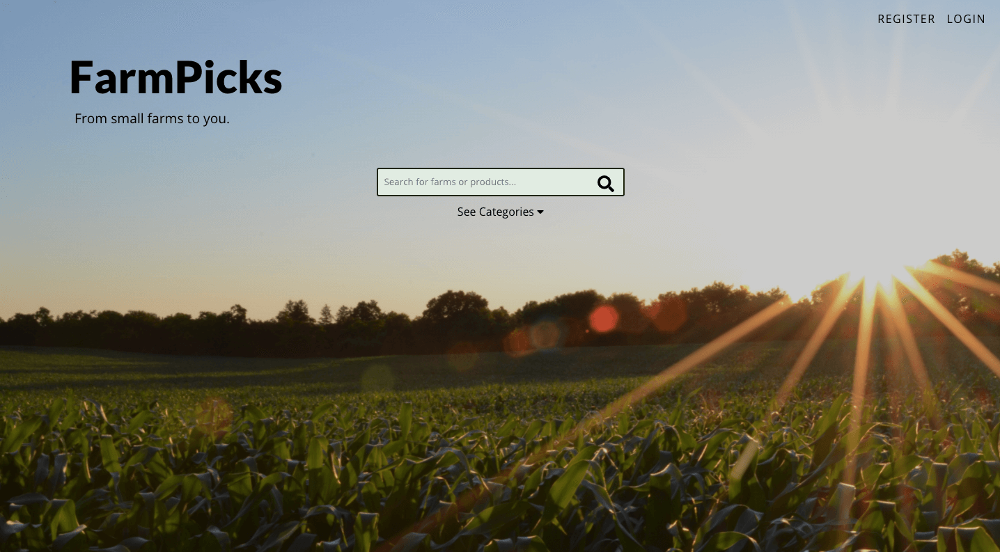
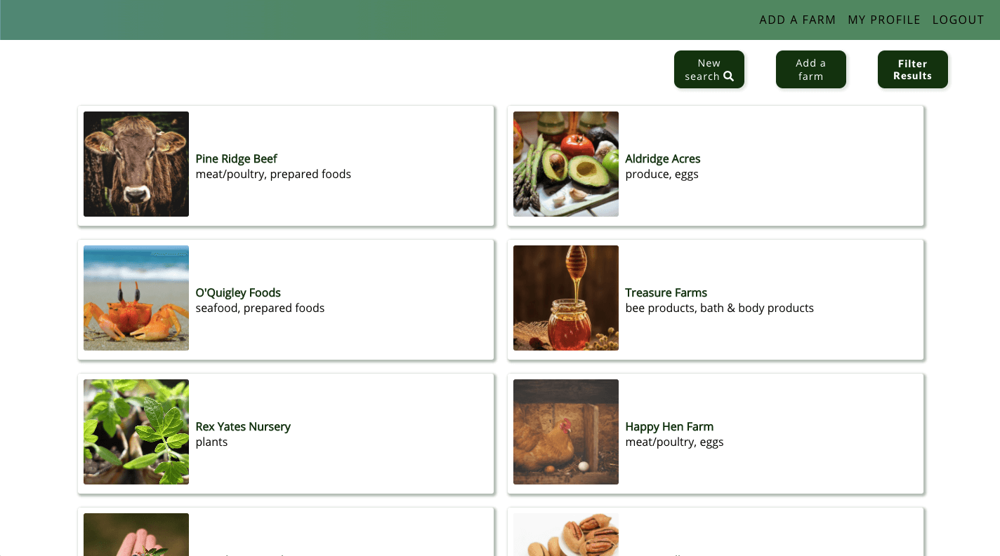
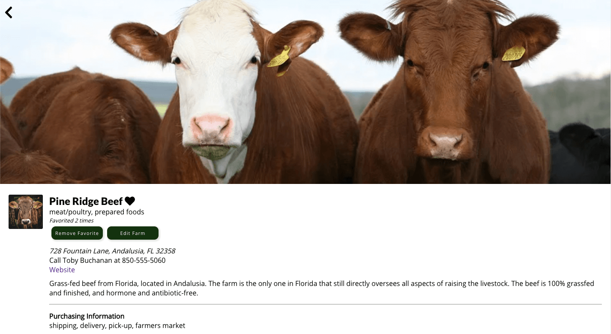

# FarmPicks - From small farms to you.

[FarmPicks](https://farmpicks.vercel.app/) is a directory app that allows users seeking information about local farms to search and browse farms and get information about them. Users can also save farms to their favorites to revisit later, and be part of the community effort to improve existing information about farms.

See FarmPicks in action here: <https://farmpicks.vercel.app/>

## Features
- Search for farms
- View information about farms in the database
- Add and remove farms from a list of favorites
- View list of favorite farms on a User Profile Page
- Add or edit information about farms

## Demo user login

To try the app out, the demo consumer login can be used as follows:

username: consumer1
password: password

## Screenshots

## Built with
- Node.js
- Express.js
- PostgreSQL

## Farmpicks Client
See the FarmPicks Client Repo at <https://github.com/rise-erpelding/farmpicks-client>

## Setting Up API

- Install dependencies: `npm install`
- Create development and test databases: `createdb farmpicks`, `createdb farmpicks-test`
- Create database user: `createuser farmpicks`
- Grant privileges to new user in `psql`:
  - `GRANT ALL PRIVILEGES ON DATABASE farmpicks TO farmpicks`
  - `GRANT ALL PRIVILEGES ON DATABASE "farmpicks-test" TO farmpicks`
- Prepare environment file: `cp example.env .env`
- Replace values in `.env` with your custom values.
- Bootstrap development database: `npm run migrate`
- Bootstrap test database: `npm run migrate:test`

## Sample Data

- To seed the database for development: `psql -U farmpicks -d farmpicks -a -f seeds/seed.sample_farms.sql`
- To clear seed data: `psql -U farmpicks -d farmpicks -a -f seeds/trunc.sample_farms.sql`

## Scripts

- Start application for development: `npm run dev`
- Run tests: `npm test`

## Endpoints

### GET /api/farms
#### Description
Retrieves farms' information matching parameters, if parameters are used. If not, retrieves all farms' information.
#### Parameters
q (string) - Optional search term
products - Optional, used to filter by type of product, must be one of:
- meat/poultry
- seafood
- dairy
- eggs
- produce
- plants
- preserves/syrup
- bee products
- nuts/dried fruits
- prepared foods
- coffee/tea
- bath & body products
purchaseOptions - Optional, used to filter by type of purchase option, must be one of:
- shipping
- delivery
- pick-up
- farmers market

### POST /api/farms
#### Description
Inserts a new farm. farm_name is required. Optional fields include:
products (array), farm_description, address_1, address_2, city, state, zip_code, contact_name, phone_number, purchase_options (array), purchase_details, website, cover_image (url), profile_image (url), archived (boolean)

### GET /api/farms/:id
#### Description
Retrieves farm information corresponding to the farm id provided.

### DELETE /api/farms/:id
#### Description
Deletes farm corresponding to the farm id provided

### PATCH /api/farms/:id
#### Description
Updates farm information for any of the fields seen in POST /api/farms

### GET /api/products
#### Description
Retrieves all product categories corresponding to existing farms in database.

### GET /api/purchase-options
#### Description
Retrieves all purchase option categories corresponding to existing farms in database.

### GET /api/users
#### Description
Retrieves user information (user_name, first_name, last_name, user_type, id) for the authenticated user.
#### Authorization
Required

### GET /api/users/favorites
#### Description
Retrieves basic information (id, farm_name, products, farm_description, profile_image) for farms added to user's favorites.
#### Authorization
Required

### POST /api/favorites/
#### Description
Adds favorited_farm (provided in request body) to user's favorite farms.
#### Authorization
Required

### DELETE /api/favorites/:id
#### Description
Removes favorite corresponding to the favorite id provided in the request.
#### Authorization
Required

### GET /api/favorites/
#### Description
Gets favorite id corresponding to current user and farm id provided in query.
#### Authorization
Required

### POST /api/auth/login
#### Description
Handles user authentication.